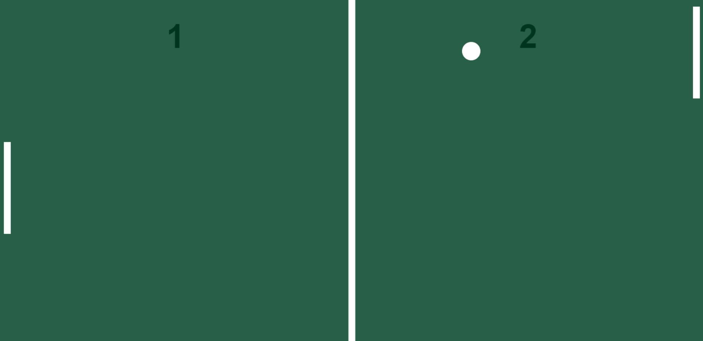

<h1 align="center"> Ping Pong </h1>

  

  

## 📜 Resumo

Esse projeto é um densenvolvimento de um mini game de ping pong contra o computador, com o intuito de aprender um pouco mais de como utilizar javascript pra realizar orientação a objetos.

Caso queira testar o jogo ele está disponivel para jogar apenas clicando na mensagem abaixo:

<a href="https://luisfv10.github.io/Ping-Pong" target="_blank">Clique aqui para jogar!!</a>

## 🚀 Tecnologias

Esse projeto foi desenvolvido com as seguintes tecnologias:

- HTML
- CSS
- JavaScript
- Git e Github

## 📝 Licença

Esse projeto está sob a licença MIT.
